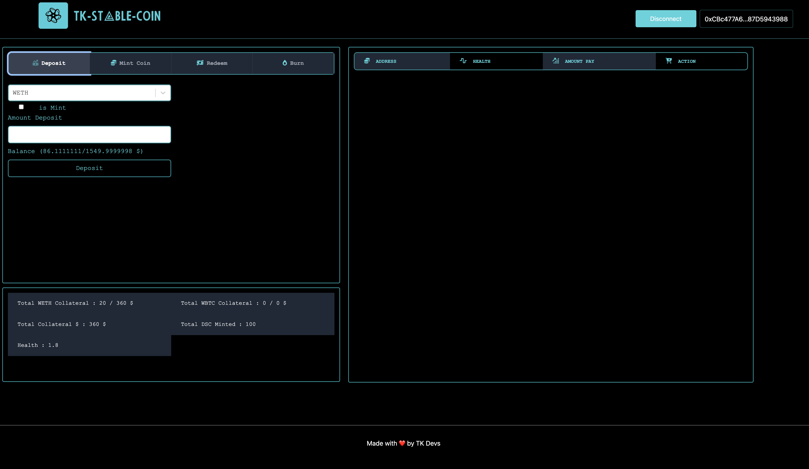

# stable-coin

  Simple UI on `NextJs` to show the actual working of the Stable Coin `DEFI` and make it easy to understand
  

### Step to install and setup

 1. `cd frontend` and `npm install`
 2. Set configuration of the project
	-  	In `src/config/address.json` copy all you deployed contract address		 
	-   In. `src/config/abi.js` copy ABI of the contract
	
#### address.json
```

{

"WETH": "0x682f6Aa39072dD888b4A5ee98e1BAe97732b4e5C",

"WBTC": "0xD3b9689aa79Fff82AAdC0798B59090799761E6de",

"DSCENGIN": "0x67e08CC6C18B777dE717A4A05bc8C300D42b40B6",

"DSC": "0xdBa49c99d03910E6cB9B1bc04cCE91573b19FeeA"

}
```  
 #### abi.js

 ```
 export  let  DSC_ENGIN  = []
 export  let  ERC20 =[]
```


### Command to deploy contract

For this case we deploy all contract on `sepolia` chain because when I try with `anvil` it will not work fine with `metamask` wallet but you can try it.
 `We also need to verify DSC Engin contract so we used subgraph for events` 
```

export PROVIDER_URL=http://127.0.0.1:8545

export PRIVATE_KEY=0xac0974bec39a17e36ba4a6b4d238ff944bacb478cbed5efcae784d7bf4f2ff80


forge create --rpc-url "http://127.0.0.1:8545" --private-key $PRIVATE_KEY src/lib/OracleLib.sol:OracleLib

  
  

forge create --rpc-url $PROVIDER_URL --constructor-args 8 100000000000 --private-key $PRIVATE_KEY src/mock/MockV3Aggregator.sol:MockV3Aggregator

  
  
  

btcUsdPriceFeed BTC Address 0x5FbDB2315678afecb367f032d93F642f64180aa3

sepolia btcUsdPriceFeed BTC Address 0xAB8d249De93951b2c53284d97030B3e715172ff3

  

forge create --rpc-url $PROVIDER_URL --constructor-args 8 200000000000 --private-key $PRIVATE_KEY src/mock/MockV3Aggregator.sol:MockV3Aggregator

  
  

ethUsdPriceFeed 0xe7f1725E7734CE288F8367e1Bb143E90bb3F0512

sepolia ethUsdPriceFeed 0x8aa3Fe2bb955443691dAca5f6A7CCF521CbE6a6a

  
  

forge create --rpc-url $PROVIDER_URL --constructor-args "WETH" "WETH" 0x0308b55f7bACa0324Ba6Ff06b22Af1B4e5d71a74 200000000000 --private-key $PRIVATE_KEY src/mock/ERC20Mock.sol:ERC20Mock

  

wethMock 0x9fE46736679d2D9a65F0992F2272dE9f3c7fa6e0

sepolia wethMock 0x682f6Aa39072dD888b4A5ee98e1BAe97732b4e5C

  

forge create --rpc-url $PROVIDER_URL --constructor-args "WBTC" "WBTC" 0x0308b55f7bACa0324Ba6Ff06b22Af1B4e5d71a74 200000000000 --private-key $PRIVATE_KEY src/mock/ERC20Mock.sol:ERC20Mock

  

wbtcMock 0xCf7Ed3AccA5a467e9e704C703E8D87F634fB0Fc9

sepolia wbtcMock 0xD3b9689aa79Fff82AAdC0798B59090799761E6de

  
  
  

forge create --rpc-url $PROVIDER_URL --private-key $PRIVATE_KEY src/core/DecenttializedStableCoin.sol:DecentralizedStableCoin

  
  

DecentralizedStableCoin 0xDc64a140Aa3E981100a9becA4E685f962f0cF6C9

sepolia DecentralizedStableCoin 0xdBa49c99d03910E6cB9B1bc04cCE91573b19FeeA

  

export tokenAddresses=["0xD3b9689aa79Fff82AAdC0798B59090799761E6de","0x682f6Aa39072dD888b4A5ee98e1BAe97732b4e5C"]

export priceFeedAddresses=["0xAB8d249De93951b2c53284d97030B3e715172ff3","0x8aa3Fe2bb955443691dAca5f6A7CCF521CbE6a6a"]

export dsc="0xdBa49c99d03910E6cB9B1bc04cCE91573b19FeeA"

export ETHERSCAN_API_KEY=<YOUR-SNOWTRACE-API-KEY>

  

forge create --rpc-url $PROVIDER_URL --constructor-args $tokenAddresses $priceFeedAddresses 0xdBa49c99d03910E6cB9B1bc04cCE91573b19FeeA --private-key $PRIVATE_KEY src/core/DSCEngine.sol:DSCEngine

  
  

DSCEngine 0x5FC8d32690cc91D4c39d9d3abcBD16989F875707

sepolia DSCEngine 0x67e08CC6C18B777dE717A4A05bc8C300D42b40B6

  

change ownership

  
  
  

forge verify-contract --chain-id 11155111 --constructor-args $(cast abi-encode "constructor(address[],address[],address)" "["0xD3b9689aa79Fff82AAdC0798B59090799761E6de","0x682f6Aa39072dD888b4A5ee98e1BAe97732b4e5C"]" "["0xAB8d249De93951b2c53284d97030B3e715172ff3","0x8aa3Fe2bb955443691dAca5f6A7CCF521CbE6a6a"]" "0xdBa49c99d03910E6cB9B1bc04cCE91573b19FeeA" ) --etherscan-api-key $ETHERSCAN_API_KEY 0x67e08CC6C18B777dE717A4A05bc8C300D42b40B6 src/core/DSCEngine.sol:DSCEngine

  
  
  

forge verify-contract 0x67e08CC6C18B777dE717A4A05bc8C300D42b40B6 --constructor-args $tokenAddresses $priceFeedAddresses "0xdBa49c99d03910E6cB9B1bc04cCE91573b19FeeA" src/core/DSCEngine.sol:DSCEngine --etherscan-api-key --chain-id 11155111 --verifier-url https://sepolia.infura.io/v3/d5c41dccf31d4df99af77831b59ea59f

  
  
  
  
  

Those are for change Price of the eth price from $2000 to $20

  

int256 ethUsdUpdatedPrice = 18e8; // 1 ETH = $18

MockV3Aggregator(ethUsdPriceFeed).updateAnswer(ethUsdUpdatedPrice);

  
  
  

export ETH_MOCK_PRICE_SEED=0x8aa3Fe2bb955443691dAca5f6A7CCF521CbE6a6a

cast send $ETH_MOCK_PRICE_SEED "updateAnswer(int256)" 1800000000 --rpc-url $PROVIDER_URL --private-key $PRIVATE_KEY

  
  

This on is for change ownership

cast send $DSC_ADDRESS "transferOwnership(address)" $DSC_ENGINE --rpc-url $PROVIDER_URL --private-key $PRIVATE_KEY

cast send 0xdBa49c99d03910E6cB9B1bc04cCE91573b19FeeA "transferOwnership(address)" 0x67e08CC6C18B777dE717A4A05bc8C300D42b40B6 --rpc-url $PROVIDER_URL --private-key $PRIVATE_KEY

  
  
  
  

forge script script/DeployDSC.s.sol:DeployDSC --broadcast --verify --rpc-url ${GOERLI_RPC_URL}

  
  

```


### Subgraph

It will help us to get all event logs on chain which we used to get list of all User who Deposit Collateral  and we can check their `health` if we found on `unhealth` then we liquidated it and get benefit from it.

go to `https://thegraph.com/` connect your wallet which you used to deploy and connect with smart contract 
easy steps to follow `https://thegraph.com/docs/en/developing/creating-a-subgraph/`
#### .env
`NEXT_PUBLIC_SUB_GRAPH=""`


#### Run Frontend 
Simple `npm run dev` and open your browser `localhost:3000` it will direct you to on landing page.
  
### Demo

[](https://www.youtube.com/watch?v=r1_Vyo5o-nA)


# Thank you!

  

[](https://medium.com/@touqeershah32)

[](https://www.youtube.com/channel/UC3oUDpfMOBefugPp4GADyUQ)

[](https://www.linkedin.com/in/touqeer-shah/)